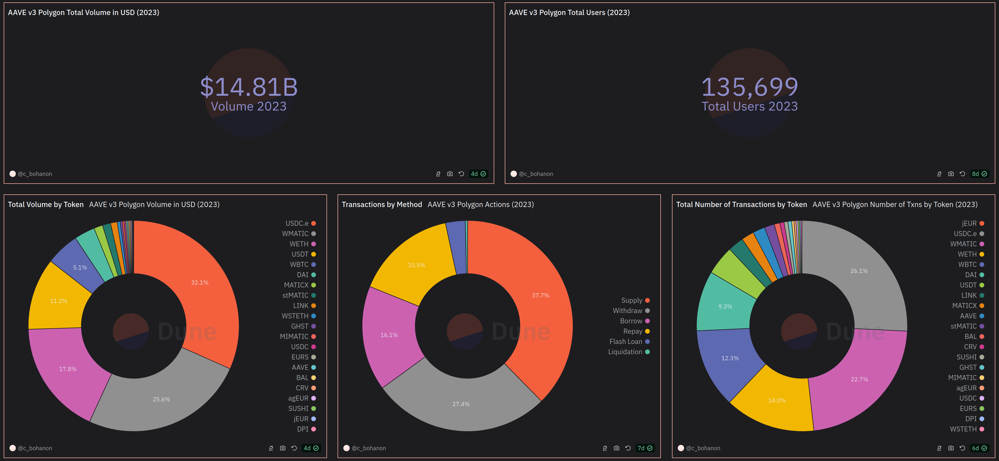
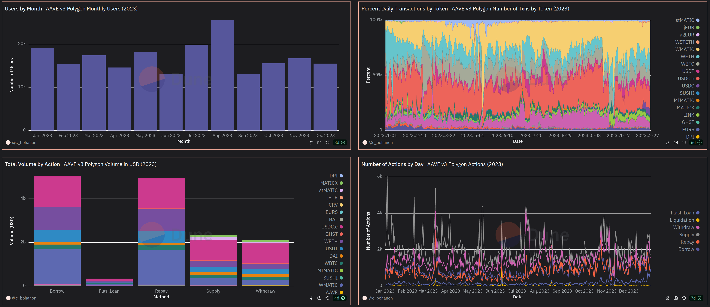

# AAVE v3 Polygon 2023 Dashboard

## Introduction

This project aims to provide an analysis of AAVE's v3 pool on the Polygon blockchain for the year 2023. After utilizing SQL queries to gather data, I've created a dashboard to demonstrate various aspects of the project's performance. The purpose of this project is to provide information to those interested in the performance of the protocol on Polygon. In the future, I would like to create a more in-depth dashboard that includes data spanning more time and blockchains.

## Data Collection

In the project, I use [Dune](https://dune.com) to query blockchain data with SQL. The queries that are used to create the dashboard can be found in the `queries` folder. Key areas of focus include the total number of users, total volume in USD, total volume by token, number of transactions by action (supply, withdraw, borrow, repay, flash loan, liquidation), and more.

## Results

The interactive version of this dashboard can be found [here](https://dune.com/c_bohanon/aave-v3-polygon-2023)
